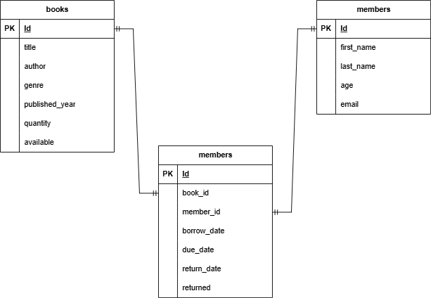

# Database Design & Normalization

The schema is split into three tables — `books`, `members`, and `loans` —
following normalization principles (up to Third Normal Form) to eliminate
redundancy and avoid update, insertion, and deletion anomalies.
## ER Diagram

## Why three tables instead of one

A naive design might store everything in a single `loans` table, repeating
the book title and member name in every loan row. That would cause:

- **Update anomaly** — changing a book's title would require updating every
  loan row for that book.
- **Insertion anomaly** — a book or member could not exist until they appeared
  in a loan.
- **Deletion anomaly** — deleting the last loan of a book would erase the book.

Splitting the data into `books`, `members`, and `loans` stores each fact once.

## First Normal Form (1NF)

Every column holds a single atomic value, and there are no repeating groups.
For example, each loan is a separate row in `loans` with one `book_id`, rather
than a list of borrowed books stored in a member row.

## Second Normal Form (2NF)

Every non-key column depends on the whole primary key. Each table uses a single
-column primary key (`id`), so there are no partial dependencies on part of a
composite key.

## Third Normal Form (3NF)

No non-key column depends on another non-key column. The `loans` table stores
`book_id` and `member_id` (references), not the book's title or the member's
name. Book and member details live only in their own tables and are retrieved
by joining. This removes transitive dependencies such as
loan → member_id → member_name.

## Relationships

- One **member** can have many **loans** (one-to-many).
- One **book** can appear in many **loans** over time (one-to-many).
- The `loans` table connects books and members via foreign keys.